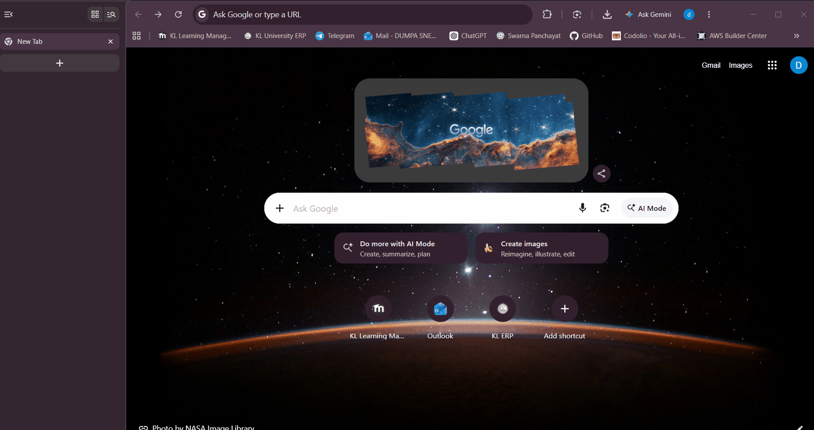
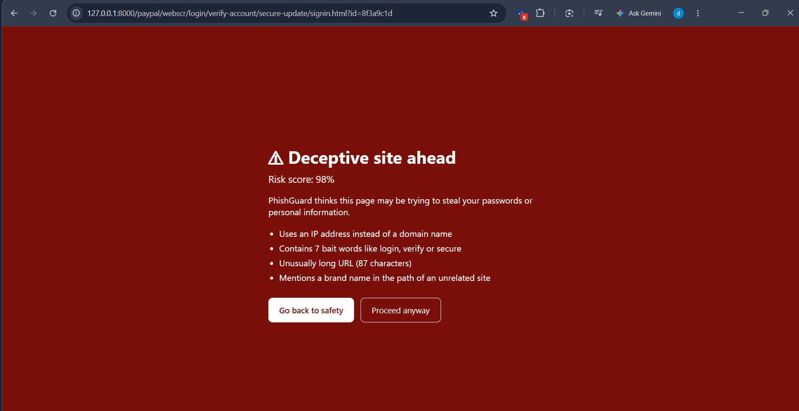
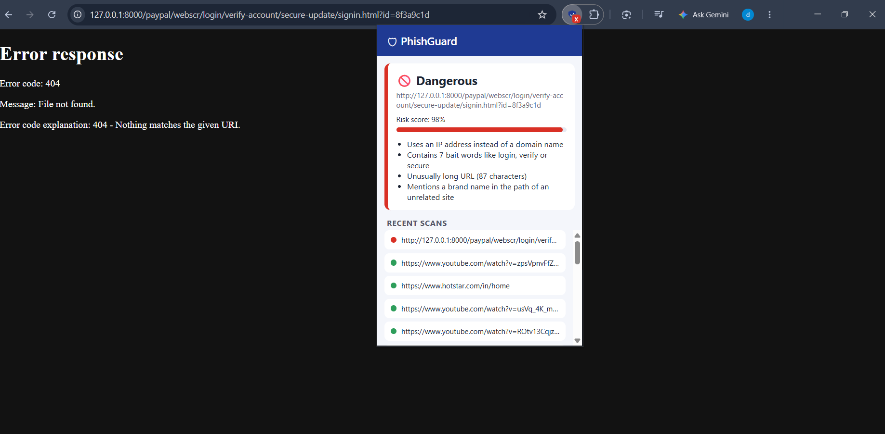
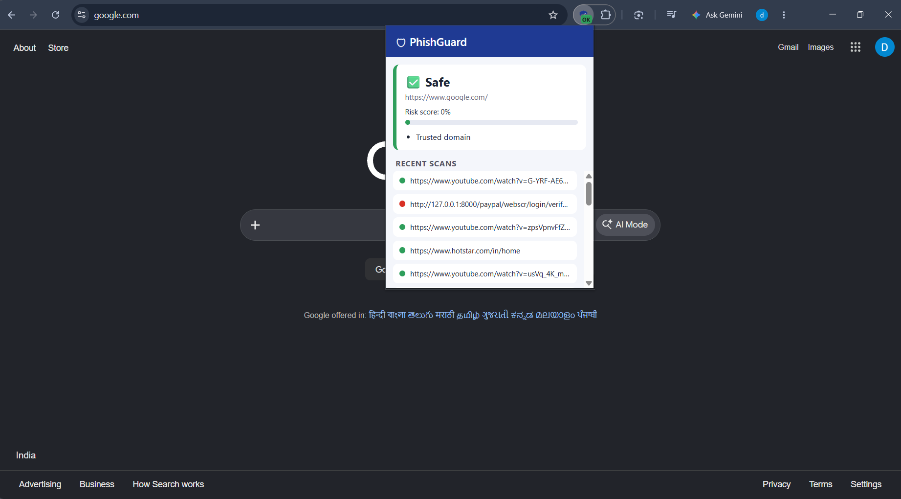
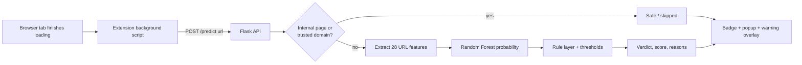

# 🛡 PhishGuard

**Real-time phishing website detection in your browser, powered by machine learning.**


PhishGuard is a Chrome extension that checks every page you open and warns you when the address looks like phishing. A Random Forest model scores each URL, a Flask API serves the verdict, and the extension shows a clear warning with **plain-language reasons** for why a site was flagged.



---

## Why this project

Phishing sites appear and disappear within hours, so blacklists are always behind. PhishGuard instead learns what phishing URLs *look like* (brand names hiding in unrelated domains, random IDs, free hosting abuse, bait words) and can flag sites it has never seen before.

The most interesting part of this project is not the model, but what happened when I tested it honestly (see [Evaluation](#evaluation-and-what-i-learned)).

## Features

- **Real-time scanning** of every page, with a colored badge on the toolbar icon (green, yellow, red)
- **Three verdicts:** Safe, Suspicious (yellow banner), Dangerous (red full-screen warning with *Go back* and *Proceed anyway*)
- **Explainable results:** every warning lists the reasons, such as "Uses a famous brand name in a domain that doesn't belong to that brand"
- **Scan history** of the last 20 pages, shown in the popup
- **Hybrid detection:** ML model, a trusted-domain whitelist, and a narrow rule layer for high-confidence patterns
- **Privacy-friendly:** URLs are sent only to the API you run on your own machine (`127.0.0.1`), never to a third party
- **No false alarms on your own projects:** `localhost` and private-network addresses (such as `192.168.x.x`) are skipped automatically

## Screenshots

| Warning page | Popup (dangerous) | Popup (safe) |
|---|---|---|
|  |  |  |

## How it works



1. When a tab finishes loading, the extension's background service worker sends the URL to the API.
2. The API skips browser-internal pages (`chrome://`, `about:`), then checks the trusted-domain whitelist.
3. Otherwise it extracts 28 features from the URL and gets a phishing probability from the model.
4. Verdict bands: **Safe** below 0.5, **Suspicious** from 0.5 to 0.7, **Dangerous** at 0.7 or above. The 0.7 threshold was chosen on a validation split.
5. The extension updates the badge, saves the scan to history, and injects a warning (inside a Shadow DOM, so the page's own CSS can't break it).

### The 28 features

| Group | Features |
|---|---|
| Length and counts | URL, host, path, query and domain length; counts of dots, hyphens, underscores, slashes, `?`, `=`, `&`, `%`, digits; digit ratio; path depth |
| Host structure | IP address instead of a domain, number of subdomains, hyphens in the domain, host entropy (randomness) |
| Suspicious signals | `@` in the URL, bait words (login, verify, secure...), URL shortener, abused TLDs (`.xyz`, `.tk`, `.sbs`...) |
| Modern phishing patterns | Brand name in the host or path of an unrelated domain, free hosting platform (blogspot, pages.dev...), UUID or long hex IDs | 

The URL scheme (`http` vs `https`) is deliberately removed before measuring, so it can't leak into the length counts.

## Evaluation and what I learned

### Step 1: A good-looking benchmark

On a random split of the public Kaggle dataset, the first models looked strong:

| Model | Accuracy | Precision | Recall | F1 | ROC-AUC |
|---|---|---|---|---|---|
| **Random Forest** | **0.9165** | 0.7980 | 0.8430 | 0.8199 | 0.9609 |
| XGBoost | 0.9008 | 0.7363 | 0.8719 | 0.7984 | 0.9619 |
| Decision Tree | 0.8676 | 0.6648 | 0.8323 | 0.7392 | 0.9271 |
| Logistic Regression | 0.7980 | 0.5426 | 0.6595 | 0.5954 | 0.8444 |

### Step 2: The honest test

I then tested the model on data it had never seen, from different sources: **300 live phishing URLs from OpenPhish** and the **top 500 sites from the Tranco list**. The result was a very different picture: **only 28% of real phishing was caught**.

### Step 3: Diagnosis and fixes

- **Distribution shift.** In the Kaggle data, legitimate URLs are long article links and phishing URLs are often short, so the model had learned "short means phishing" instead of what phishing really looks like. No threshold could fix it.
- **Missing modern patterns.** The missed URLs were things like `facebook-new-security.blogspot.com` and random-ID pages on free hosts, so I added features for brand-in-host mismatch, free hosting abuse, and random IDs.
- **Retrained** on a mix of the old data, fresh phishing URLs from Phishing.Database, and legitimate homepages from Tranco (ranks 501 to 20,000, kept separate from the test set).
- **Threshold chosen on a validation split**, and the real-world test run once, so the final numbers stay honest.

### Final results (real-world test, model only)

| | First model | Final model |
|---|---|---|
| Phishing caught (recall) | 28% (83 of 300) | **66% (198 of 300)** |
| Precision when flagging phishing | 93% | **98%** |
| False alarms on legitimate sites | 6 of 500 | **4 of 500** |
| Accuracy | 72% | **87%** |

Confusion matrix of the final model: `[[496, 4], [102, 198]]`. These numbers are for the model alone; the whitelist and rule layer in the API add further protection against false alarms and obvious brand-impersonation URLs.

### Bugs I found and fixed along the way

- **Scheme leak:** training URLs had no `https://` but test URLs did, which inflated length features. Fixed by stripping the scheme.
- **Substring bug:** the shortener check looked for `t.co` inside host names, so it wrongly matched `blogspot.com`. Fixed by comparing exact domains.
- **Whitelist trap:** whitelisting the top 10,000 domains would have trusted `anything.blogspot.com`. Fixed by matching on the registered domain and excluding shared hosting platforms.

## Tech stack

| Layer | Tools |
|---|---|
| ML | Python, pandas, scikit-learn (Random Forest), XGBoost (compared), tldextract |
| Backend | Flask, Flask-CORS, joblib |
| Extension | Chrome Manifest V3, JavaScript, service worker, content script (Shadow DOM), `chrome.storage` |
| Data | Kaggle Phishing Site URLs, Phishing.Database, OpenPhish, Tranco top sites |

## Project structure

```
phishguard/
├── backend/
│   ├── app.py               # Flask API (/health, /predict), whitelist, rule layer
│   ├── features.py          # URL feature extraction (28 features)
│   ├── test_api.py          # API smoke tests
│   └── make_icons.py        # generates the extension icons
├── extension/
│   ├── manifest.json
│   ├── background.js        # scans tabs, sets badge, stores history
│   ├── content.js           # warning banner / full-screen overlay
│   └── popup.html / popup.css / popup.js
├── notebooks/
│   ├── 01_explore_data.ipynb
│   ├── 02_features.ipynb
│   ├── 03_train_models.ipynb
│   ├── 04_real_world_test.ipynb
│   └── 05_retrain.ipynb     # final training set, model and real-world test
├── docs/                    # demo GIF and screenshots
└── requirements.txt
```

## Getting started

The trained model and datasets are not stored in this repository (they are large), so you train the model yourself. It takes a few minutes.

**1. Clone and install**

```bash
git clone https://github.com/YOUR-USERNAME/phishguard.git
cd phishguard
python -m venv venv
venv\Scripts\activate          # Windows  (Mac/Linux: source venv/bin/activate)
pip install -r requirements.txt
```

**2. Download the data into a `data/` folder**

| File | Source |
|---|---|
| `phishing_site_urls.csv` | Kaggle, "Phishing Site URLs" dataset |
| `openphish.txt` | OpenPhish free feed (`feed.txt`) |
| `phishing_db.txt` | Phishing.Database, `phishing-links-ACTIVE.txt` |
| `top-1m.csv` | Tranco top-sites list |

Only read these phishing lists as text; never open the links in a browser.

**3. Train the model**

Open `notebooks/05_retrain.ipynb` and run all cells. It writes `backend/model_v2.pkl` and `backend/feature_columns_v2.pkl`. (The API uses a threshold of 0.7 by default.)

Optional but recommended, to create the trusted-domain whitelist:

```bash
python -c "import pandas as pd; pd.read_csv('data/top-1m.csv',header=None,names=['r','d'])['d'].head(10000).to_csv('backend/top_domains.txt',index=False,header=False)"
```

**4. Start the API**

```bash
cd backend
python app.py
```

Check `http://127.0.0.1:5000/health` in your browser.

**5. Load the extension**

1. Open `chrome://extensions` and turn on **Developer mode**.
2. Click **Load unpacked** and select the `extension` folder.
3. Pin PhishGuard from the puzzle-piece menu.

**6. Try it safely**

Never visit real phishing sites. To see the warning, serve a harmless local page:

```bash
python -m http.server 8000
```

Then open `http://127.0.0.1:8000/paypal/webscr/login/verify-account/secure-update/signin.html?id=8f3a9c1d`. The address looks like phishing, so PhishGuard flags it. You can also score any URL as text without opening it:

```powershell
Invoke-RestMethod -Uri http://127.0.0.1:5000/predict -Method Post -ContentType "application/json" -Body '{"url":"http://secure-paypal-login.verify-account.xyz/signin"}'
```

Run the API smoke tests with `python backend/test_api.py`.

## Limitations

- **A URL-only model misses about one third of live phishing**, because some phishing URLs look completely ordinary. Page-content signals would help.
- It was trained on public lists, so its view of phishing reflects those sources and their date. Phishing tactics change, so the model needs regular retraining.
- The brand list and bait words are English-centric.
- The whitelist trusts popular domains, so it cannot catch phishing hosted *inside* trusted platforms.
- The test set is limited to 300 phishing URLs, so the exact percentages carry some uncertainty.
- The extension currently talks to a locally run API, so the server must be running.

## Roadmap

- [x] Skip localhost and private-network addresses
- [ ] Page-content features (for example, password forms that submit to another domain)
- [ ] SHAP explanations of each prediction
- [ ] Deploy the API to the cloud (AWS) so the extension works without a local server
- [ ] Retrain on a rolling feed of fresh phishing URLs
- [ ] Email-link scanning

## Disclaimer

PhishGuard is an educational project and does not replace the browser's built-in protection or a professional security product.

## Author

**Dumpa Sneha Latha Reddy**
B.Tech Computer Science Engineering (Cyber Security), KL University

[GitHub](https://github.com/kl2400032691) · [LinkedIn](https://www.linkedin.com/in/dumpa-sneha-latha-reddy-363b84375)
